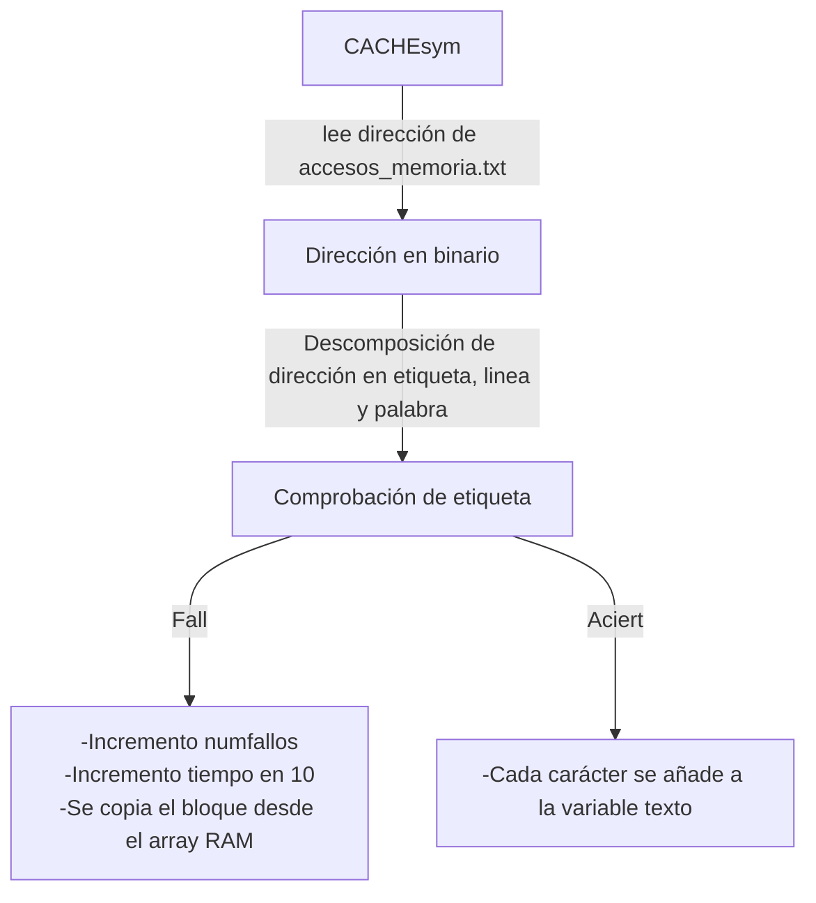

# Proyecto I Sistemas Operativos

## Introducción

Este proyecto consiste en la elaboración de un simulador de memoria caché de un sistema ficticio de los años 70 llamado SUPERTRONIX.
Este sistema tenía un bus de memoria de 10 bits y usaba memoria real, con una caché de 4 líneas con correspondencia directa y 8 bytes por línea.

## Desarrollo
Para el desarrollo se ha utilizado C sobre Linux (Ubuntu) para la creación de un proceso llamado **CACHEsym**. El proceso cuenta con un array de 4 elementos, del tipo T_LINEA_CACHE, cuya definición es:
```c
typedef struct {
    short int ETQ; 
    short int Datos[8];
} T_LINEA_CACHE;
```
>El campo etiqueta se inicializa a FF (hexadecimal) y a 0 todos los campos de datos de la caché.

Una vez definido estos elementos, hay que leer los ficheros `RAM.bin` en una variable llamada `RAM`, que es un array de 1024 `unsigned char`. A continuación comienza la lectura del fichero de texto `accesos_memoria.txt` que contiene una lista de direcciones de memoria en hexadecimal, una por linea. 
Se repetirá el siguiente protocolo:



El proceso vuelca el contenido de la caché por pantalla con el siguiente formato:
```
T: 82, Fallo de CACHE 8, ADDR 0010 ETQ 0 linea 02 palabra 00 bloque 02
Cargando el bloque 02 en la linea 02
T: 92, Acierto de CACHE, ADDR 0010 ETQ 0 linea 02 palabra 00 DATO 71
ETQ:10  Datos 74 72 71 70 6F 6E 6D
ETQ:18  Datos 69 68 67 66 65 64 63 62
ETQ:0   Datos 78 77 76 75 74 73 72 71
ETQ:0   Datos 67 66 65 64 63 62 61 79`
```


